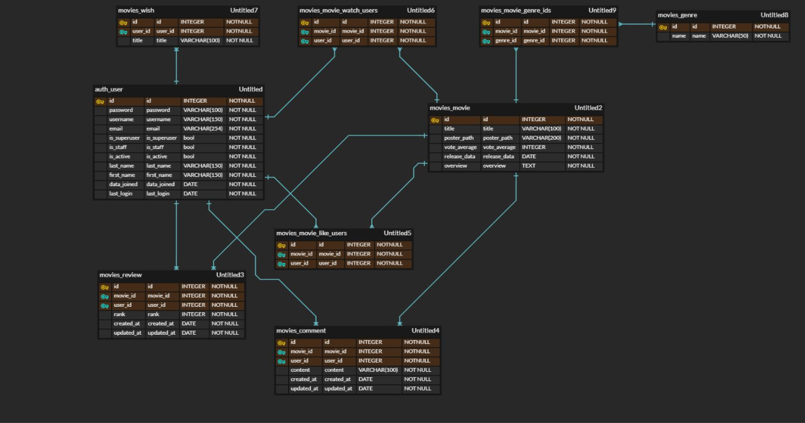
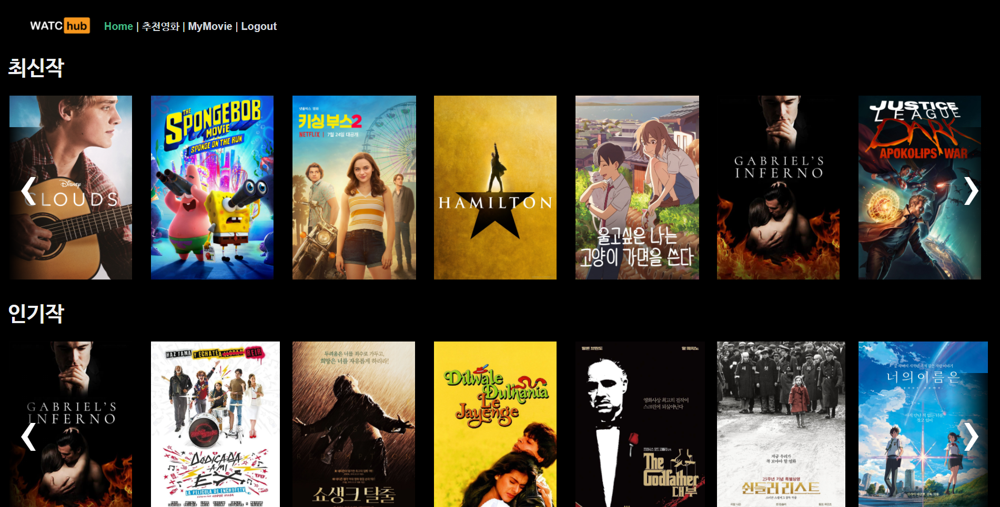
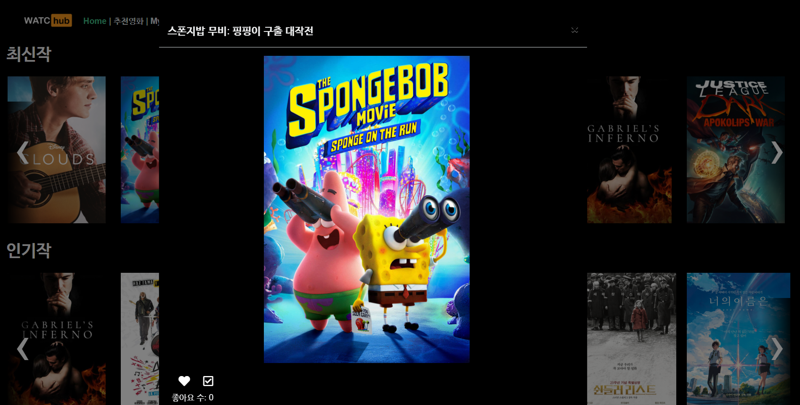
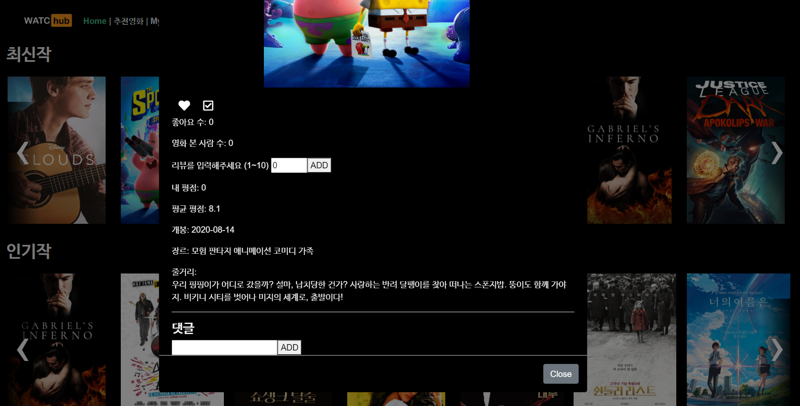
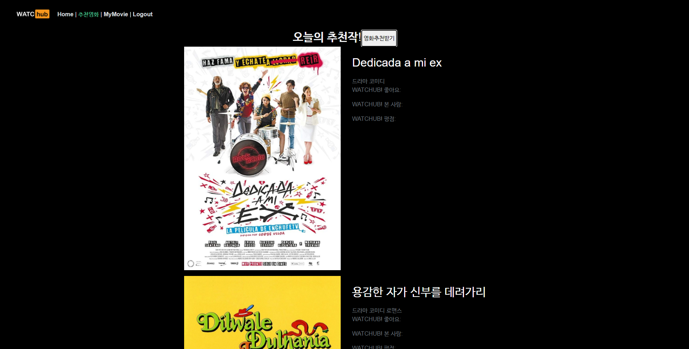
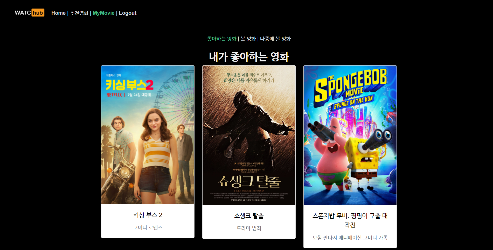
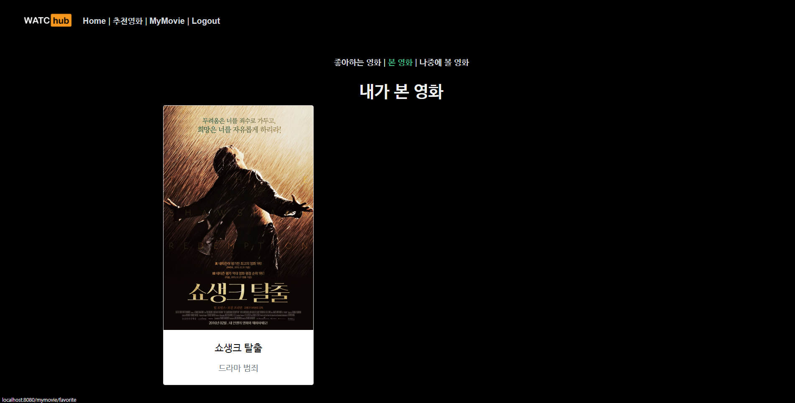
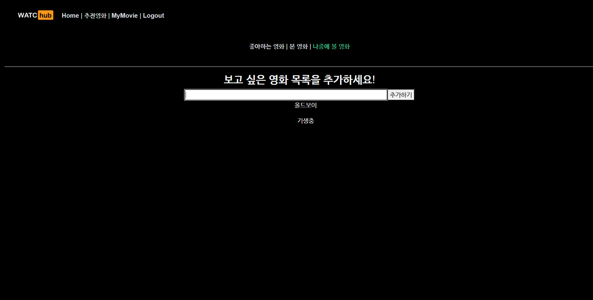

# README

[TOC]

## 1. 팀원 정보 및 업무 분담 내역

**`팀원 1. 조성국(본인)`: Front-end & 팀장 역할**

1. TMDB API 활용하여 데이터 수집 & load data
2. 백엔드 API활용하여 데이터 가공 & 표시
   
   - html
   - css
     - bootstrap
   - javascript
   - Vuejs
     - vuex
     - vue router
     - vue glide
   - Ajax 비동기 요청
   - axios
4. 로고 제작
5. 발표용 영상 제작


**`팀원 2. 황윤호`: Back-end **

1. 백엔드 API
2. DB 구성 및 ERD
3. 추천 알고리즘
   - 좋아요/평점/시청기록 활용
4. 로그인/회원가입
   - JWT token auth
5. 관리자 사이트
   - superuser


## 2. 목표 서비스 구현 및 실제 구현 정도

>  목표 기능 구현 90% 이상

예상 추가 작업

1. 추천 알고리즘 고도화
2. 평점 디자인 변경 -> 별점


## 3. 개발환경


### 3-A. 언어

1. Python 3.7.7
2. Django 3.1
3. Node 14.15.0
4. npm 6.14.8
5. Vue.js 2.6+
6. Vue/cli 4.5.9

### 3-B. 도구

​		i. vsCode
​		ii. Chrome Browser

### 3-C. 아키텍처

​		~~i. Django & Vanila JS~~
​		**ii. Django REST API 서버 & Vue.js**

```text
# Back-end 파일 트리

├── .vscode
|	├── settings.json
├── venv
├── watchub
|	├── accounts
|	|	├── __pycache__
|	|	├── migrations
|	|	└── templates
|	|	|	├── accounts
|	|	|		├── login.html
|	|	|		└── signup.html
|	|	├── __init__.py
|	|	├── __admin__.py
|	|	├── apps.py
|	|	├── forms.py
|	|	├── models.py
|	|	├── serializers.py
|	|	├── tests.py
|	|	├── urls.py
|	|	└── views.py
|	|
│   ├── movies
│	│	├── __pycache__
│	│	├── fixtures
|	|	|	└── Movie.json
│	│	├── migrations
│	│	├── __init__.py
│	│	├── admin.py
│	│	├── apps.py
│	│	├── forms.py
│	│	├── models.py
│	│	├── serializers.py
│	│	├── tests.py
│	│	├── urls.py
│	│	└── views.py
│   ├── watchub
│	│	├── __pycache__
│	│	├── templates
│	│	│	└── base.html
│	│	├── __init__.py
│	│	├── asgi.py
│	│	├── settings.py
│	│	├── urls.py
│	│	└── wsgi.py
│   ├── db.sqlite3
│   └── manage.py
│
├── .gitignore
├── requirements.txt
└── README.md
```

```text
# Front-end 파일 트리

├── node_modules
|	├── ...
├── public
|	├── index.html
|	├── style.css
|	├── favicon.ico
├── src
|	├── assets
|	├── components
|	|	├── Home
|	|	|	├── Carousel.vue
|	|	|	├── Classic.vue
|	|	|	├── Latest.vue
|	|	|	├── Popular.vue
|	|	├── MyMvie
|	|	|	├── Favorite.vue
|	|	|	├── Already.vue
|	|	|	├── Wishlist.vue
|	├── router
|	├── store
|	├── views
|	|	├── accounts
|	|	|	├── Login.vue
|	|	|	├── Signup.vue
|	|	├── Home.vue
|	|	├── MyMovie.vue
|	|	├── Recommend.vue
|	|	├── ReommendCarousel.vue
```


## 4. 데이터베이스 모델링(ERD)




## 5. 필수 기능에 대한 설명

### 5-A. 커뮤니티

1. 좋아요
   - user가 영화에 대해 좋아요를 할 수 있음
   - 추후 추천 알고리즘에 활용
2. 시청기록
   - user가 영화에 대해 시청기록을 표기할 수 있음
   - 추후 추천 알고리즘에 활용
3. 평점
   - user가 영화에 대해 rank를 1~10까지 줄 수 있음
   - 별점형식으로 Front-end 개선 예정
   - 추후 추천 알고리즘에 활용
4. 댓글
   - user가 영화에 대해 코멘트 남길 수 있음
   - 내가 쓴 댓글은 삭제 가능







### 5-B. 추천 알고리즘

```markdown
이미 본 영화여서 시청기록이 있다면 추천 알고리즘에서 제외시킨다
좋아요한 영화들의 장르들을 모아 카운팅한다.
가장 좋아하는 장르 top 1~3를 가지고 이 장르의 영화들을 추천 목록에 올린다.
```



### 5-C.  마이페이지

- 내가 좋아하는 영화 목록
  - 좋아요 누른 영화들의 목록을 보여줍니다.
- 내가 본 영화 목록
  - 시청한 영화들의 목록을 보여줍니다.
- 보고 싶은 영화
  - 나중에 보고 싶은 영화들을 기록할 수 있는 입력창과 그 데이터들을 보여줍니다.







## 6. 배포 서버 URL

[배포서버 URL]()


## 7. 기타(느낀점)

```markdown
## 1. django 와 Vuejs로 프론트엔드와 백엔드를 따로 분리해서 만드는 과정을 처음으로 협업해보면서 양쪽의 소통이 쉽지 않다는 것을 느꼈습니다. postman을 활용해 백엔드에서 만든 API를 테스트해볼 때에는 잘 작동하던 API도 막상 프론트엔드에서는 필수 요소값을 불러올 수 없어 API를 활용하지 못하는 경우가 많았습니다. 누군가에게는 쉽게 얻을 수 있는 데이터지만 누군가에게는 접근하기 어려운 데이터일 수 있다는 것을 알았습니다.

## 2. 명세서를 구체적이고 꼼꼼하게 작성하는 것이 중요하다는 것을 알았습니다. 명확한 명세서가 없으니 중간 중간 고민하는 부분이 많았고 결과적으로 이 부분에서 많은 시간을 허비했습니다. 처음부터 모든 것을 완벽히 준비할 수는 없겠지만 DB 모델링과 같이 필수적인 내용들은 꼭 구체적으로 미리 작성해두는 것이 좋을 것  같다고 생각했습니다.

## 3. Front-end부분을 맡으면서 Vuejs와 javascript에 어느 정도 친숙해질 수 있는 시간이어서 좋았습니다.

## 4. 짧은 프로젝트였지만 많이 성장할 수 있었던 좋은 시간이었습니다. 또한 SSAFY과정 중 스스로 얼마나 성장했는지, 그리고 현재 부족한 점이 무엇인지 파악할 수 있는 값진 경험이었습니다.
```

